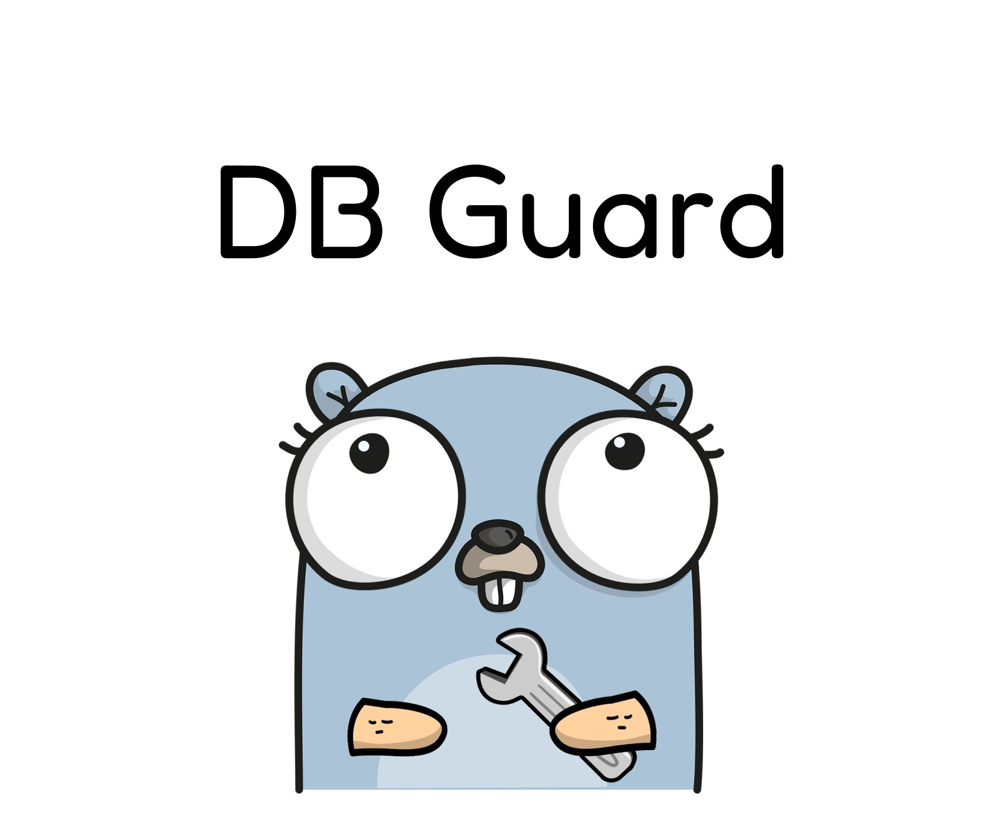

# DB Guard

DB Guard is a Golang project aimed at streamlining database backup procedures with automated scheduling. 

*Disclaimer: This project is designed for PostgreSQL databases only, but it can be extended to support other database management systems.*

### Key Advantages:
- **Automated Backups**: Streamline database backup processes with scheduled intervals.
- **Real-Time Notifications**: Receive instant updates on backup statuses via Telegram notifications.
- **Optimized Storage**: Utilize parallel file archiving to maximize disk space efficiency.

## Prerequisites
- PostgreSQL client (for PostgreSQL databases)

## How to Run
### Option 1: Run via Command Line
You can run the application directly from the command line. You have two options:
1. If you don't want to receive Telegram notifications:
```bash
go run cmd/db-dump.go --host=<your-db-host> --port=<your-db-port> --user=<your-db-user> --password=<your-db-password> --compress --compression-level=<your-compression-level> --database=<your-db-name> --max-backup-count=<your-max-backup-count> --interval-seconds=<your-interval-in-seconds> --dir=<your-backups-dir>
```

2. If you want to receive Telegram notifications:
- Create a bot using [BotFather](https://t.me/BotFather) and obtain the token in the format `123456789:ABC-DEF1234ghIkl-zyx57W2v1u123ew11`
- Find your chat ID using [chat_id_echo_bot](https://t.me/chat_id_echo_bot)
- Execute the following command:
```bash
TELEGRAM_BOT_TOKEN=123456789:ABC-DEF1234ghIkl-zyx57W2v1u123ew11 CHANNEL_ID=11123456789 go run cmd/db-dump.go --host=<your-db-host> --port=<your-db-port> --user=<your-db-user> --password=<your-db-password> --compress --compression-level=<your-compression-level> --database=<your-db-name> --max-backup-count=<your-max-backup-count> --interval-seconds=<your-interval-in-seconds> --dir=<your-backups-dir> --telegram-notifications
```


### Option 2: Run via Docker Container
You can also run the application using Docker by executing the following command:
```bash
docker compose up -d --build
```
Ensure you have provided necessary configurations in a `.env` file. Refer to the `.env-sample` for an example.

## Parameters
- `--host`: Hostname of the database server
- `--port`: Port number of the database server
- `--user`: Username for authentication
- `--password`: Password for authentication
- `--compress`: Enable compression for backup files
- `--compression-level`: Level of compression (Default: -1)
- `--database`: Name of the database to backup
- `--max-backup-count`: Maximum number of backup files to retain
- `--interval-seconds`: Interval between each backup (in seconds)
- `--dir`: Directory to store backup files
- `--telegram-notifications`: Enable Telegram notifications (optional)

## Compression Levels
You can specify the compression level using the following options:
- NoCompression (0)
- BestSpeed (1)
- BestCompression (9)
- DefaultCompression (-1) (Default)
- HuffmanOnly (-2)

## Show your support
Give a ⭐️ if this project helped you!

## License
Copyright © 2023 [dasha.smyr@gmail.com](https://github.com/dariasmyr).<br />
This project is [MIT](LICENSE) licensed.